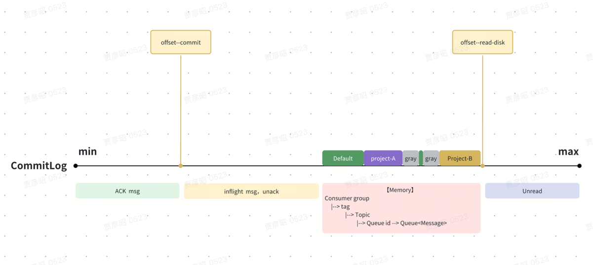
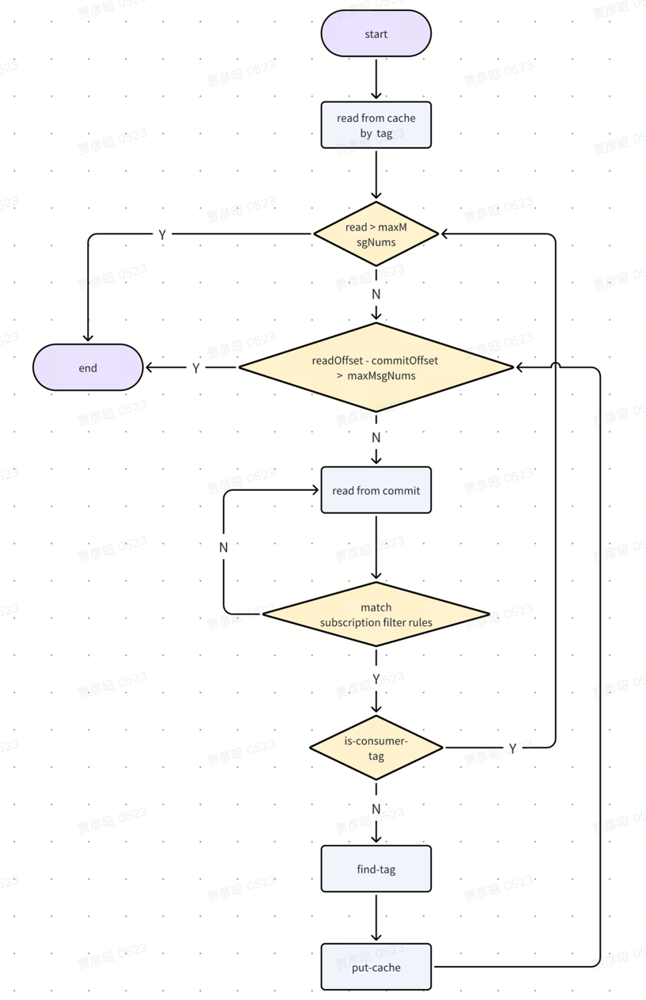
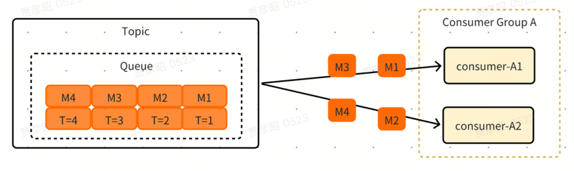
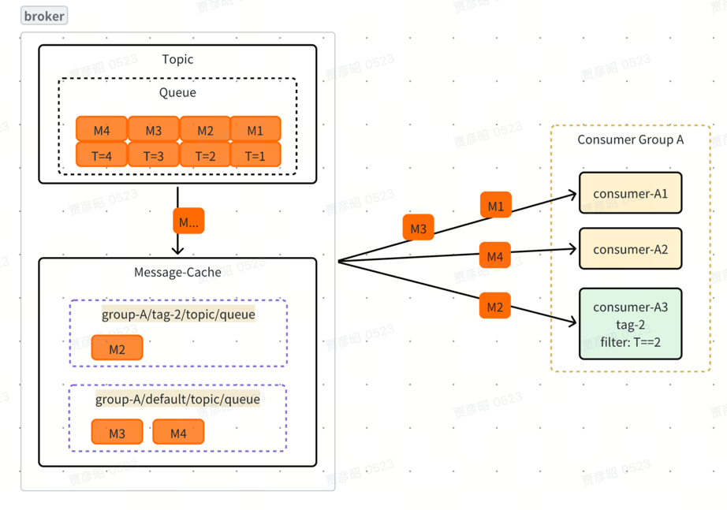
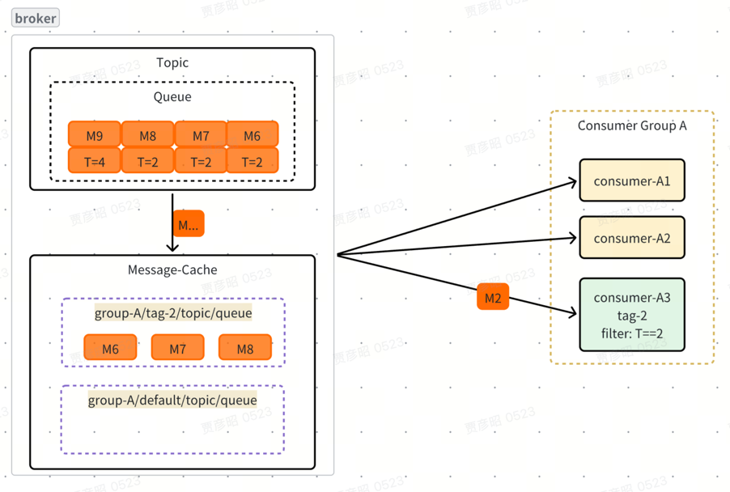
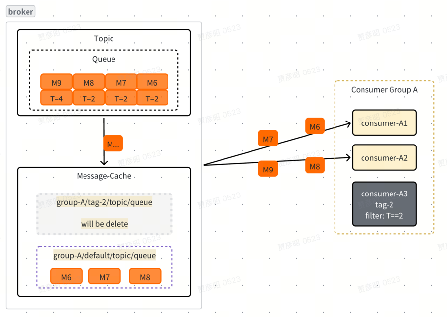

# 状态
- 当前状态：已提出
- 作者：[imjyz](https://github.com/imjyz)
- 邮件列表讨论：dev@rocketmq.apache.org

# 背景与动机

## 我们需要做什么

- 是否会新增模块？

  否。

- 是否会新增 API？

  否，我们将修改消费者配置。

- 是否会新增功能？

  是，将在同一订阅下增加基于消费者的路由能力。

## 为什么要做这件事

- 当前项目是否存在任何问题？

  是的，在 RocketMQ 中，一个消费者组内的所有消费者会根据订阅均匀地消费来自同一主题队列的消息。

  然而，在某些场景下，需要不同的消费者处理消息的不同子集——例如在多环境部署或灰度发布中。

  虽然可以通过使用不同的消费者组来实现这一点，但这会增加运维复杂性并降低灵活性，使得难以实现动态路由或优雅降级策略。

- 提议的变更能带来哪些好处？

  更灵活的消费方式，原生支持灰度发布和多环境部署。

# 目标
- 本提案旨在解决什么问题？

  实现更灵活的消费方式，原生支持灰度发布和多环境部署。

- 问题应解决到什么程度？

  允许用户在客户端动态配置，但不能通过 Broker 接口指定。因为只有客户端实现才能支持动态发现。

# 非目标
- 本提案**不**旨在解决什么问题？

  替代多租户场景中对主题隔离的需求。

- 本提案是否存在任何限制？

  仅支持 Pop 消费者。

# 变更内容

## 架构

### 客户端

**消费者客户端支持以下可配置属性：**

- **consumer-tag**：消费者为自己定义的标签，而非消息的标签。同一 `consumer-group` 内的不同消费者可配置不同的标签。
- **consumer-tag-filter-conditions**：消费者基于消息属性定义的过滤条件，用于确定哪些消息可以匹配当前的 `consumer-tag`；这与订阅中使用的过滤表达式不同。
- **message-push-ratio**：匹配 `consumer-tag-filter-conditions` 的消息被推送给该消费者的比例。
- **allow-degraded-messages**：消费者是否接受降级消息。当设为 true 时，将接收所有消息，上述三项配置将失效。若无任何配置，默认为 true。

**约束条件**

- 每个消费者只允许拥有一个标签（consumer-tag）。
- `consumer-tag` 可在主题级别或客户端级别进行配置。
- `consumer-tag` 与 `filter-conditions` 必须一一对应；在同一消费者组内，严禁一个 `consumer-tag` 关联多个 `filter-conditions`。
- 未配置标签的消费者被视为**默认消费者**，会被分配一个默认标签，并**允许接收降级消息**。
- 仅支持 Pop 消费者。

### Broker 端

#### PopMessage

在 `MessageStore` 中新增消息缓存机制。（不是最终实现）

缓存可选择存储于内存或 RocksDB，
**无需保证持久性**——即使 Broker 宕机导致缓存丢失，
也可在重启后基于 `commit offset` 重新消费，确保数据不丢失。

缓存采用分层的 key-value 结构，其中：

- **Key**：具有层级语义的字符串，便于按维度高效组织与检索，格式为 `consumer-group/tag/topic/queue`。
- **Value**：一个带容量限制的消息队列（`Queue<Message>`），其最大大小（`maxSize`）可配置，用于防止缓存无限增长。

  <div style="text-align: center">
      
  </div>


**消息拉取逻辑：**

  <div style="text-align: center">
     
  </div>

1. **优先从缓存读取消息**：根据当前消费者的 `consumer-tag` 从缓存中拉取消息。若已读取的消息数量达到 `maxMsgNums`，则立即返回响应。

2. **防止过度堆积**：计算当前读取偏移量（read-offset）与提交偏移量（commit-offset）之间的差值。若该差值超过可配置的阈值 `MaxPendingMessages`，则不再从 `commitLog` 读取新消息。此机制在客户端表现为“消息堆积”。

3. **过滤订阅规则**：若需从 `commitLog` 读取消息，先使用订阅规则过滤。不匹配的消息将被跳过，继续读取下一条。

4. **Tag 匹配与缓存写入**：

    - 若消息匹配当前消费者的 `consumer-tag`，则将其加入响应结果；
    - 若不匹配，则遍历该消费者组内所有已注册的 `tag-filter` 规则，尝试为消息分配一个合适的 `tag` 并写入缓存；
    - 若没有任何 `tag` 能匹配该消息，则将其标记为 `default` 并写入缓存。

   **补充说明**：
   - **常规场景**：有可接收降级消息的 `default-consumer`，能够消费所有标记为 `default` 的消息。
   - **异常场景**：若 `default-consumer` 宕机或未部署，则无法匹配任何 `tag` 的消息仍会被标记为 `default` 并持续写入缓存。当缓存达到容量上限后，将阻塞后续消费，形成背压（backpressure）。


**以下是几个示例：**

1. **常规场景**，仅由 default-consumer 消费，此场景下不会使用缓存。

    <div style="text-align: center">
        
    </div>

2. **灰度发布开始**，default-consumer 和 tag-consumer 共存

    <div style="text-align: center">
        
    </div>

3. **灰度consumer消费严重滞后**，导致其他 tag 消息的消费被阻塞。

    <div style="text-align: center">
            
    </div>

4. **灰度 Consumer 宕机或下线**，缓存中的消息由 default-consumer 接管并消费

    <div style="text-align: center">
        
    </div>

**QA**

  **Q:** 容错与可靠性：若某个消费者发生故障，如何确保消息不丢失并尽可能减少重复消费
    
  **A:** 消费者宕机，其关联的消息将由默认消费者继续消费。如果不存在默认消费者，会在缓存达到上限后阻塞消费。在此期间不会丢消息，也不会有重复消费
    
  **Q:** 资源风险：如果某个消费者卡住或严重滞后，其关联的缓存是否会无限增长
    
  **A:** 缓存有大小限制，不会无限增长，某个消费者消费滞后会导致缓存达到上限，阻塞消费。在用户侧的反馈是 消息堆积。


#### 维护消费者元数据

我们可以在 `ConsumerGroupInfo` 中维护元数据，数据为key-value结构，key分层存储，示例：

- consumer-group/topic/tag : {"filter":"", "ratio":""}
- consumer-group/topic/tag : ["consumer-A", "consumer-B", "consumer-xx"]

Broker 端将持有如下数据：

| tag   | filter | ratio | allow degraded msg | consumer    |
|-------|--------|-------|--------------------|-------------|
| tag-A | v=2.0  | 0.5   | false              | consumer-A1 |
| tag-A | v=2.0  | 0.5   | false              | consumer-A2 |
| tag-B | env=qa | 1     | false              | consumer-B1 |
| /     | /      | /     | true               | consumer-C1 |


**consumer事件**

1. consumer 注册
   * default-consumer 存在，只更新元数据
   * default-consumer 不存在
     * 注册的是 default-tag 或 已存在的tag，只更新元数据
     * 注册的是 new-tag，除更新元数据外，如果default-tag不存在，要遍历 default-tag 缓存的所有消息，匹配new-tag的消息迁移到对应的缓存中
2. consumer 下线/宕机
   * 还有相同 tag 的consumer存活，只更新元数据
   * 没有相同tag的consumer存活
     * 宕机的是 default-consumer，只更新元数据，因为 default-tag 消息本就用于兜底，无需迁移。
     * 宕机的是非default-consumer，除更新元数据外，还要把该 tag 缓存中的消息迁移到 default-tag 下

注意：在实现时不必物理迁移消息。只需标记某 tag 的缓存消息可被其他 tag 处理，由消费逻辑在读取时动态识别并路由即可

## 接口设计/变更

### 客户端

1. 新增配置类：

    ```java
    public class ConsumerTag {
        private String tag;
        private String filterConditions;
        private double messagePushRatio = 1.0d;
        private boolean allowDegradedMessages = Boolean.TRUE;
    }
    ```

2. 在 `SimpleConsumerImpl`、`PushConsumerImpl`、`SimpleSubscriptionSettings` 和 `PushSubscriptionSettings` 中新增属性：

    ```java
    private Map<String /* topic */, ConsumerTag> consumerTags;
    ```

3. 在 `SimpleConsumerImpl` 和 `PushConsumerImpl` 中新增方法：

    ```java
    public SimpleConsumer subscribe(String topic, FilterExpression filterExpression, ConsumerTag consumerTag) throws ClientException{
        consumerTags.put(topic, consumerTag);
        ...
    }
    ```

### Broker 端

1. 在 `ConsumerGroupInfo` 中新增字段以维护消费者标签的元数据：

   ```java
    Map<String/*topic*/, Map<String/*tag*/, ConsumerTag>> tagTable;
    Map<String/*topic*/, Map<String/*tag*/, Set<clientId>>> clientTagTable;
    ```

2. 实现路径字典（Trie）
     ```java
     public class PathTrie<T> {
         
         private static class Node<T> {
             final ConcurrentHashMap<String, Node<T>> children = new ConcurrentHashMap<>();
             volatile Queue<T> valueQueue;
             boolean isLeaf() {
                 return children.isEmpty();
             }
         }
     
         private final Node<Message> root = new Node<>();
         
         public void put(String path, T item) {}
         
         public Queue<Message> getQueue(String path) {}
         
         public List<Node<T>> getAllNodeUnderPrefix(String prefixPath) {}
         
         private Node<T> findNode(String path) {}
     }
     ```
3. 在 MessageStore 新增缓存字段， 此处忽略 getMessage 方法的变更
   ```java
   /* consumer-group/tag/topic/queue : Queue<Message> */
   PathTrie<Message> messageCache;
   ```

# 兼容性、弃用与迁移计划

该新功能向前兼容，无需迁移，且不会弃用任何现有 API。

# 被否决的替代方案

**有两种支持灰度方案**：
1. **新建 Consumer group 灰度**，存在重复消费和消息丢失两种边界问题
  * 应用在灰度环境发布时，若不修改基础环境的订阅条件，大量重复消费的场景是不可接受的。但何时修改基础环境的订阅条件又是一个挑战。
    * **上线过程**：必须保证基础环境的 offset 大于灰度环境的。此时切换有少量重复消费；否则可能丢消息，但这要求发布系统感知消费进度，并处理消息积压等异常情况。
    * **下线过程**：必须保证灰度环境的 offset 大于基础环境的。此时切换有少量重复消费；否则可能丢消息，但灰度环境的消费速率无法保证，若速率较慢则需扩容等操作，待其追上后才能执行下线。

2. **隔离 queue 灰度**，参考：[#8468](https://github.com/apache/rocketmq/issues/8468)
  * 该方案较好地解决了边界问题，但仍不够灵活。

**使用 consumer tag 方案的优势**：

1. **灰度测试不依赖生产者**

    场景示例：某个 Topic 有一个生产者、多个消费者。某一时刻，consumer-app-A 和 consumer-app-B 同时在测试，但 app-A 需验证租户 A 的流量，app-B 需验证租户 B 的流量。
    
    使用 Consumer Tag 方案，只需分别为 app-A 和 app-B 设置对应的 tag 和 filter 即可，且不会重复消费，没有边界问题。而上述灰度方案在此场景下会发生冲突。

2. **支持多环境隔离**

    场景示例：User-A 和 User-B 分别测试应用的不同功能。使用 Consumer Tag 方案，他们在发布应用时只需设置不同的 tag 和 filter 即可。

3. **支持比例路由**

    消费者可选择仅消费 1% 的消息，或在满足 filter 条件后消费其中 1% 的消息。

4. **消息可降级**

    当指定的 consumer-tag 存在时，由对应 consumer 消费；若不存在，则由 default-consumer 消费。既不会重复消费，也不会丢失消息。