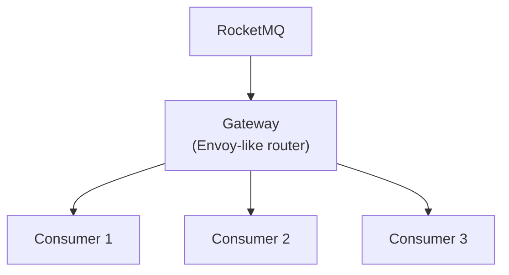

# RocketMQ 支持消费路由

## 摘要

本文讨论在 RocketMQ 中为同一个 topic + consumer group 增加消费路由能力，使不同特征的 consumer 可以在同一订阅关系下消费不同子集的消息。核心思路是在 Broker 侧根据消息属性和 consumer label 做路由匹配：匹配当前 consumer subset 的消息直接返回；匹配其他 subset 的消息写入轻量级 route topic，后续由目标 subset 消费。

方案目标是支持灰度发布、多环境部署和兜底降级，同时尽量复用现有 Pop、CK、ConsumeQueue、CommitLog 和顺序消费机制，避免新增一套独立的 offset 管理体系。

## 一、背景

RocketMQ 当前不支持在同一个 consumer group 内按 consumer 特征做灰度消费。常见替代方案是为灰度环境创建独立 consumer group，但这种做法会带来两个问题：

- 发布系统需要额外管理多组 consumer group，接入和运维成本较高。
- 切流时需要严格控制消费位点，否则容易出现重复消费、漏消费或灰度流量不可控。

因此，更理想的方式是在保持同一订阅关系的前提下，让 Broker 根据 consumer 的特征标签和消息属性完成路由。

## 二、目标

让 RocketMQ 原生支持应用灰度发布和多环境部署。效果上类似在 RocketMQ 和 consumer 之间增加一层轻量网关：同一个 topic + consumer group 下，Broker 可以根据客户端特征将消息分发给不同 consumer subset。



示例：demo_app 订阅了 TopicA，consumer group 是 group_A；在蓝绿发布期间 group_A 下会有两组不同特征的 consumer，分别是：

1. `app = demo_app`, `version = blue`
2. `app = demo_app`, `version = green`

多环境部署时，特征是：

1. `app = demo_app`, `env = qa_project_01`
2. `app = demo_app`, `env = qa_project_02`

## 三、方案

> 以下使用 YAML 描述配置模型的逻辑结构，仅用于提升可读性。实际实现中会定义对应的 Java 类。

关键术语：

- **label**：consumer 启动时上报的特征标签，例如 `app`、`version`、`env`。
- **subset**：一组满足相同 label 条件的 consumer 集合，例如 `cluster_demo_app_blue`。
- **route rule**：按消息属性匹配目标 subset 的规则。
- **route topic**：Broker 内部 topic，用于保存已路由但尚未被目标 subset 消费的 RouterPoint。
- **RouterPoint**：只包含原始消息位点的轻量路由元数据，不包含消息体。

### 1. Client

在 Settings 中增加 `label` 属性。`label` 是 `Map<String, String>` 结构，用于描述 consumer 的可扩展元数据，方便运维系统按应用、版本、环境、项目等维度做路由管控。

示例：

```yaml
label:
  app: demo_app
  version: blue
  env: qa
  project: xxx01
```

### 2. Broker

#### 2.1 Client metadata 管理

Broker 创建两个索引来管理 client label 元数据，数据来自 client 启动时的自动注册。

```java
Map<Client, Set<Label>> clientLabelMap;

Map<Label, Set<Client>> labelInvertedMap;
```

#### 2.2 Router rule 管理

> 参考 Envoy

Broker 对外暴露两个接口，用于管理消费者子集和路由规则，方便对接发布系统或控制台。

定义消费者子集，subset 类似 Envoy/Istio 中的 DestinationRule：

```yaml
- name: cluster_demo_app_blue
  client:
    app: demo_app
    version: blue
    env: prod

- name: cluster_demo_app_basic
  client:
    app: demo_app
    version: stable
    env: prod
```

定义流量路由规则，类似 Envoy/Istio 中的 VirtualService：

```yaml
name: route_demo_app
topic: demo_topic
consumerGroup: consumer_demo_app
rules:
  # 规则 1：userId 为 1, 2, 3 的内部测试流量去蓝区
  - match:
      - attributes:
          userId:
            in: ["1", "2", "3"]
    route:
      - subset: cluster_demo_app_blue
        weight: 100
  # 规则 2：默认所有其他流量去基线版本
  - route:
      - subset: cluster_demo_app_basic
        weight: 100
```

每条规则从上到下匹配，命中第一条即停止。最后一条不带 match 的规则作为兜底。

#### 2.3 Pop 路由流程

> 参考 CK 和 retry topic 实现

##### 2.3.1 设计原则

1. **轻量元数据路由**：route topic 仅存储消息位点（RouterPoint，约 100 字节），不存储消息体；consumer 消费时从原始 commitLog 回查消息体。
2. **复用现有机制**：route topic 通过 CommitLog 持久化、ConsumeQueue 顺序读；consumer 复用现有 Pop CK/ACK 流程，无需新增独立 offset 管理体系。
3. **按 topic 类型区分 queue 策略**：普通 topic 每个 subset 共享一个 route queue；顺序 topic 按原始 queueId 隔离 route queue，保证 per-queue 有序。

##### 2.3.2 route topic

broker 为每个拥有路由规则的 topic 和 consumer group 创建一个 route topic，命名为 `%ROUTE%{consumerGroup}_{topic}`，用于暂存已读取但不匹配当前 consumer 的消息路由元数据。

route topic 中的每条消息是一个 RouterPoint（参考 CK），只存储一段连续的消息位点，不存储消息体。consumer 消费时根据 RouterPoint 中的 offset 从原始 topic 的 commitLog 中读取消息体。

route topic 的类型继承原始 topic：如果原始 topic 是顺序 topic，则对应的 route topic 也创建为顺序 topic，确保 consumer 从 route topic pop 时走顺序消费流程（`ConsumerOrderInfoManager`），保证 per-queue 有序投递。

**route topic 的 queue 设计**

route topic 的 queue 策略按原始 topic 类型区分：

- **普通 topic**：不需要保序，每个 subset 只需要一个 route queue，所有原始 queue 的路由消息汇聚到同一个 queue 中。
- **顺序 topic**：需要保持 per-queue 有序，每个 subset × 每个原始 queueId 对应一个独立的 route queue。

queue 映射关系通过 Map 维护（而非公式计算），以支持原始 queue 动态扩容：

```java
/**
 * route topic queue 映射管理
 * 在路由规则生效或原始 topic queue 数量变化时重新构建
 */
class RouteQueueMapping {
    // subsetName → { originalQueueId → routeTopicQueueId }
    Map<String, Map<Integer, Integer>> mapping;
}
```

普通 topic 的映射示例（2 个 subset, 4 个原始 queue）：

```
subset-blue  → {0→0, 1→0, 2→0, 3→0}   // 所有原始 queue 汇聚到 route queue 0
subset-green → {0→1, 1→1, 2→1, 3→1}   // 所有原始 queue 汇聚到 route queue 1

route topic 共 2 个 queue
```

顺序 topic 的映射示例（2 个 subset, 4 个原始 queue）：

```
subset-blue  → {0→0, 1→1, 2→2, 3→3}   // 每个原始 queue 独立映射
subset-green → {0→4, 1→5, 2→6, 3→7}   // 每个原始 queue 独立映射

route topic 共 8 个 queue
```

原始 queue 扩容时（例如从 4 扩到 8），只需在 Map 中追加新 queue 的映射，已有映射不变：

```
// 顺序 topic 扩容示例
subset-blue  → {0→0, 1→1, ..., 3→3, 4→8, 5→9, 6→10, 7→11}   // 追加 queue 4~7
subset-green → {0→4, 1→5, ..., 3→7, 4→12, 5→13, 6→14, 7→15}
```

每个 route topic queue 只包含单一 subset 的消息，消费时无需过滤，顺序 pop 也不会被其他 subset 阻塞。

**subset 下线时的 queue 处理**

以顺序 topic 为例，假设初始有 subset-blue 和 subset-green 两个 subset：

```
初始状态（2 subset, 4 原始 queue → route topic 8 queue）：
subset-blue  → {0→0, 1→1, 2→2, 3→3}
subset-green → {0→4, 1→5, 2→6, 3→7}
```

当 subset-green 的所有 consumer 下线：

```
1. 路由规则中移除 subset-green
   → 后续新消息不再路由到 subset-green

2. route topic queue 4~7 中可能还有未消费的 RouterPoint
   → 如果配置了没有 match 条件的兜底 rule
     兜底的 consumer 接管这些 queue，消费剩余消息
   → 如果没有兜底的路由规则
     这些 queue 中的消息会根据 commitLogRetentionCheckRatio 配置路由到死信队列，或等待过期清理
     一般都会配置兜底规则，并通过监控告警观测这种异常

3. queue 映射更新：
   subset-blue  → {0→0, 1→1, 2→2, 3→3}   // 不变
   subset-green → (移除)                  // queue 4~7 不再写入新消息

4. 如果 subset-green 后续重新上线：
   重新分配 queue 映射，可复用原 queue 4~7（如果 offset 仍有效）
   或分配新的 queue（如果原 queue 已被清理）
```

##### 2.3.3 RouterPoint 消息格式

消息格式参考 CK，每条消息只存储一段连续的消息位点：

```java
public class RouterPoint implements Comparable<RouterPoint> {
    @JSONField(name = "t")
    private String topic;               // 原始 topic
    @JSONField(name = "q")
    private int queueId;                // 原始 queueId
    @JSONField(name = "so")
    private long startOffset;           // 批次基准 offset
    @JSONField(name = "c")
    private String consumerGroup;
    @JSONField(name = "sn")
    private String subsetName;          // 路由目标 subset
    @JSONField(name = "rt")
    private long routeTime;             // 路由时间戳
    @JSONField(name = "n")
    private byte num;                   // 本批次消息数量（最大 32）
    @JSONField(name = "d")
    private List<Integer> queueOffsetDiff; // 各消息相对 startOffset 的偏移
    @JSONField(name = "bn")
    private String brokerName;
}
```

每条 RouterPoint 约 100~200 字节，通过 diff 编码压缩 offset 列表。consumer 消费时通过 `startOffset + queueOffsetDiff[i]` 计算出每条消息在原始 queue 中的绝对 offset，再从 commitLog 读取消息体。

##### 2.3.4 核心流程

###### 2.3.4.1 非顺序消息

**Pop 消息主流程（改造 PopMessageProcessor.popMsgFromQueue）**

```
Consumer(subset-X) 发起 pop 请求
    │
    ▼
┌─ Phase 1: 从 route topic 消费 ────────────────────────────────
│  从 %ROUTE%{group}_{topic} 的 subset-X 对应 queue 中 pop
│  读到 RouterPoint → 按 offset 从原始 commitLog 读取消息体
│  为原始消息创建原 topic 的 CK（后续 ACK/重试由原 topic CK 管理）
│  立即 ACK RouterPoint，推进 route topic offset
│  达到 maxMsgNums → 直接返回
└──────────────────────────────────────────────────────────────
    │ 未满
    ▼
┌─ Phase 2: 从 commitLog 读取新消息 ─────────────────────────────
│  从 max(consumerOffset, readOffset) 开始读取
│  readOffset：记录 Phase 2 已读取但未匹配的最大 offset，避免重复读取;
│  对每条通过 subscription filter 的消息做路由匹配：
│    ├─ 匹配 subset-X → 加入响应，走现有 CK 流程
│    │                 更新 readOffset = 当前消息 offset + 1
│    └─ 匹配 subset-Y → 构建 RouterPoint，写入 route topic
│                       更新 readOffset = 当前消息 offset + 1
│
│  如果读取位点超过 consumerOffset + maxRouteLookAheadOffset：
│    → 停止查找，返回空，并将 readOffset 更新到已扫描边界
│
│  如果找到匹配消息：
│    → readOffset 推进到已读取的最大 offset
│    → consumerOffset 由 CK 机制推进
└──────────────────────────────────────────────────────────────
    │
    ▼
  返回响应
```

**Phase 2 中创建 RouterPoint 的逻辑**

```java
// 在 popMsgFromQueue 的结果处理中，对消息做路由匹配
Map<String/*subset*/, RouterPoint> pendingRouterPoints = new HashMap<>();

for (SelectMappedBufferResult buffer : result.getMessageMapedList()) {
    MessageExt msg = MessageDecoder.decode(buffer);
    String matchedSubset = matchSubset(consumerGroup, topic, msg);

    if (matchedSubset.equals(currentSubset)) {
        // 匹配当前 consumer 的 subset → 正常返回，走现有 CK 流程
        getMessageResult.addMessage(buffer);
    } else {
        // 匹配其他 subset → 构建 RouterPoint
        RouterPoint rp = pendingRouterPoints.computeIfAbsent(matchedSubset,
            k -> newRouterPoint(topic, queueId, consumerGroup, matchedSubset));
        rp.addDiff((int)(msg.getQueueOffset() - rp.getStartOffset()));
    }
}

// 批量写入 route topic
for (RouterPoint rp : pendingRouterPoints.values()) {
    putRouterPointToRouteTopic(rp);
}
```

`putRouterPointToRouteTopic` 的实现（与 revive topic 写入 CK 类似）：

```java
private void putRouterPointToRouteTopic(RouterPoint rp) {
    MessageExtBrokerInner msgInner = new MessageExtBrokerInner();
    String routeTopic = KeyBuilder.buildRouteTopic(rp.getConsumerGroup(), rp.getTopic());
    msgInner.setTopic(routeTopic);
    msgInner.setBody(JSON.toJSONString(rp).getBytes(StandardCharsets.UTF_8));
    // 通过 RouteQueueMapping 查找目标 queueId
    msgInner.setQueueId(routeQueueMapping.getRouteQueueId(rp.getSubsetName(), rp.getQueueId()));
    msgInner.setTags(PopAckConstants.ROUTER_POINT_TAG);
    msgInner.setBornTimestamp(System.currentTimeMillis());
    msgInner.setBornHost(brokerController.getStoreHost());
    msgInner.setStoreHost(brokerController.getStoreHost());
    msgInner.setPropertiesString(
        MessageDecoder.messageProperties2String(msgInner.getProperties()));
    brokerController.getMessageStore().asyncPutMessage(msgInner);
}
```

**Phase 1 从 route topic 消费的流程**

consumer 从 route topic pop 到 RouterPoint 后，根据其中的 offset 回查原始 commitLog：

```java
RouterPoint rp = JSON.parseObject(routeMsg.getBody(), RouterPoint.class);

for (int i = 0; i < rp.getNum(); i++) {
    long msgOffset = rp.ackOffsetByIndex(i);
    // 从原始 topic 的 commitLog 读取消息体
    MessageExt bizMsg = escapeBridge.getMessage(
        rp.getTopic(), msgOffset, rp.getQueueId(), rp.getBrokerName());
    if (bizMsg != null) {
        getMessageResult.addMessage(bizMsg);
    }
}

// 为提取出的消息创建原 topic 的 CK（后续 ACK/重试由原 topic CK 管理）
appendCheckPoint(rp.getTopic(), rp.getQueueId(), ...);

// 立即 ACK RouterPoint，推进 route topic offset
ackRouterPoint(routeMsg);
```

route topic 仅作为路由元数据的 FIFO 传递通道，RouterPoint 被消费后立即 ACK。消息的后续生命周期（consumer ACK、超时重试、写入 retry topic）全部由原 topic 的 CK 机制管理，与 route topic 无关。

###### 2.3.4.2 顺序消息

顺序消息的 Pop 使用 `ConsumerOrderInfoManager`（不使用 CK）。

**原始 queue 侧：Pre-ACK**

Pop 读取消息时，非匹配消息写入 route topic 后，在原 queue 的 OrderInfo 中立即标记为已 ACK（pre-ACK），使其不参与 `needBlock()` 的阻塞判断：

```java
if (isOrder) {
    long preAckBitmap = 0;
    int index = 0;
    List<Long> allOffsets = new ArrayList<>();
    Map<String/*subset*/, RouterPoint> pendingRouterPoints = new HashMap<>();

    for (SelectMappedBufferResult buffer : result.getMessageMapedList()) {
        MessageExt msg = MessageDecoder.decode(buffer);
        allOffsets.add(msg.getQueueOffset());

        String matchedSubset = matchSubset(consumerGroup, topic, msg);
        if (matchedSubset.equals(currentSubset)) {
            getMessageResult.addMessage(buffer);
        } else {
            // 按 subset 聚合，与非顺序消息逻辑一致
            RouterPoint rp = pendingRouterPoints.computeIfAbsent(matchedSubset,
                k -> newRouterPoint(topic, queueId, consumerGroup, matchedSubset));
            rp.addDiff((int)(msg.getQueueOffset() - rp.getStartOffset()));
            preAckBitmap |= (1L << index);
        }
        index++;
    }

    // 批量写入 route topic
    for (RouterPoint rp : pendingRouterPoints.values()) {
        putRouterPointToRouteTopic(rp);
    }

    // 用全量 offset 更新 OrderInfo（包含已路由消息）
    consumerOrderInfoManager.update(attemptId, ..., allOffsets, orderCountInfo);
    // pre-ACK 已路由消息，使其不阻塞 queue
    OrderInfo info = consumerOrderInfoManager.getOrderInfo(topic, group, queueId);
    info.setCommitOffsetBit(info.getCommitOffsetBit() | preAckBitmap);

    consumerOffsetManager.commitOffset(..., finalOffset);
}
```

Pre-ACK 与 OrderInfo 的兼容性验证——以消息 `[A₁=100, B₁=101, A₂=102, B₂=103]` 为例，B 被路由到其他 subset，pre-ACK 后 `commitOffsetBit = 0b1010`：

```
ACK(A₁=100): bit = 0b1011 → getNextOffset() → 102（第一个未 ACK）→ commitOffset(102)
ACK(A₂=102): bit = 0b1111 → getNextOffset() → 104（全部 ACK）  → commitOffset(104) ✓
```

`needBlock()` 只检查未 ACK 的消息，已 pre-ACK 的路由消息不参与阻塞。不需要修改 `ConsumerOrderInfoManager`、`checkBlock`、`commitAndNext`、`getNextOffset` 中的任何代码。

**route topic 侧：独立的顺序消费管理**

与非顺序消息不同，顺序消息的 route topic 消费**不能**将消息生命周期转交原 topic 管理，原因：

1. **offset 冲突**：原 queue 的 offset 已经通过 pre-ACK 推进到更远位置，如果 route topic 消费后再用原 topic 的 `ConsumerOrderInfoManager` 注册更早的 offset，会导致 `commitAndNext` 混乱
2. **OrderInfo 容量限制**：`commitOffsetBit` 是 long 类型（最多 64 位），多个 subset 共享原 queue 的 OrderInfo 时，累积的未 ACK 消息数量可能超过 64，溢出

因此，顺序 route topic 由自身的 `ConsumerOrderInfoManager` 独立管理 ACK 和超时重投：

```
Consumer-B(subset-Y) pop 顺序 route topic queue-5:
  │
  ├── 1. checkBlock(routeTopic, group, queue-5)
  │      → route topic 的 OrderInfo，与原 topic 无关
  │
  ├── 2. 读到 RouterPoint → 从原始 commitLog 提取消息体
  │
  ├── 3. consumerOrderInfoManager.update(routeTopic, group, queue-5, ...)
  │      → 在 route topic 维度创建 OrderInfo
  │      → 消息在 route topic 的 queue 内有序
  │
  └── 4. 返回消息给 consumer-B
       （响应中携带原 topic + 原 queueId + offset，客户端无感 route topic）

Consumer-B ACK（原 topic, 原 queueId, offset）:
  → Broker 收到 ACK，识别该消息来自 route topic（通过 extraInfo 中的标记）
  → 内部转换为 ackOrderly(routeTopic, group, routeQueueId, routeOffset)
  → route topic 的 OrderInfo.commitAndNext()
  → route topic offset 推进
  （客户端全程只感知原 topic，路由转换在 Broker 端完成）

Consumer-B 超时未 ACK:
  → route topic 的 needBlock() 超时放行
  → 下次 pop 时重新投递同一条 RouterPoint
  → 从 commitLog 重新提取消息体
```

由于 route topic 按 subset + originalQueueId 隔离（每个 queue 只有单一 subset 的消息），consumer 从 route topic 做顺序 pop 时不存在 subset 交叉阻塞问题。route topic 中消息的写入顺序与原始 queue 中的出现顺序一致（queue 锁保证），天然有序。

###### 2.3.4.3 与 CK 机制的关系

| 维度        | PopCheckPoint (CK)                   | RouterPoint（非顺序）                              | RouterPoint（顺序）                                   |
| --------- | ------------------------------------ | --------------------------------------------- | ------------------------------------------------- |
| 追踪对象      | 已返回给消费者、等待 ACK 的消息                   | 未返回、待路由给其他 subset 的消息                         | 同左                                                |
| 存储位置      | revive topic / PopBufferMergeService | route topic（CommitLog）                        | 同左                                                |
| 生命终止      | 消费者 ACK                              | 目标 subset consumer 读取后立即 ACK                  | consumer ACK 后由 route topic OrderInfo 推进          |
| 消息生命周期管理  | CK 管理 ACK/超时重试                       | 不管理；消息提取后转交原 topic CK 管理                      | route topic 自身的 ConsumerOrderInfoManager 管理       |
| 超时处理      | PopReviveService → 写入 retry topic 重投 | route topic 无超时处理；读取后马上 ACK，不存在超时场景           | route topic OrderInfo 超时放行后重新投递同一 RouterPoint     |
| Offset 管理 | 阻止原始 queue commit-offset 推进          | route topic offset 即时推进，与原始 queue offset 互不影响 | route topic offset 由 OrderInfo.commitAndNext() 推进 |

两者独立运行，互不干扰。非顺序场景下 route topic 仅作为 FIFO 传递通道；顺序场景下 route topic 独立管理消息的顺序消费生命周期。

##### 2.3.5 Offset 管理

原始 queue 和 route topic 各有独立的 offset 线，路由模式下引入 readOffset 避免重复读取：

> `readOffset` 仅存储在内存中。Broker 重启后会丢失，并从 `consumerOffset` 重新开始扫描。

```
原始 queue 的 offset:
  consumerOffset → 已成功消费的消息位点（由 CK/OrderInfo 管理）
  readOffset     → Phase 2 已读取但未匹配当前 subset 的最大位点
                   避免在 maxRouteLookAheadOffset 范围内重复读取不匹配消息

  Phase 2 读取起点 = max(consumerOffset, readOffset)

  非顺序消息 → consumerOffset 由 PopBufferMergeService 管理
               非匹配消息写入 route topic 后等价于"已处理"
               CK 中不包含这些消息，不阻塞 offset 推进
  顺序消息   → 非匹配消息 pre-ACK 后不阻塞 getNextOffset() 正确计算

route topic 的 offset:
  非顺序消息 → RouterPoint 被消费后立即 ACK，offset 直接推进
               route topic 仅作为 FIFO 传递通道，消息生命周期由原 topic CK 管理
  顺序消息   → route topic 有独立的 ConsumerOrderInfoManager 管理
               consumer ACK 后由 route topic 的 OrderInfo.commitAndNext() 推进
```

两条 offset 线完全独立，不需要额外协调。

##### 2.3.6 路由匹配

> 参考 [Envoy Matching API](https://www.envoyproxy.io/docs/envoy/latest/intro/arch_overview/advanced/matching/matching_api) 的树形匹配设计，避免线性遍历规则列表。

**匹配算法**

路由规则在写入时预编译为树形结构，匹配时按属性逐层查找，避免逐条遍历：

```
规则列表（线性遍历，O(N)）：
  rule1: userId in [1,2,3]    → subset-blue
  rule2: env = "qa"           → subset-green
  rule3: (无条件)              → subset-basic

编译为匹配树（sublinear）：
  MatchTree
  ├── "userId" (精确匹配，HashMap)
  │    ├── "1" → subset-blue
  │    ├── "2" → subset-blue
  │    └── "3" → subset-blue
  ├── "env" (精确匹配，HashMap)
  │    └── "qa" → subset-green
  └── default → subset-basic
```

匹配时从消息属性中提取 key，在对应层级做 HashMap O(1) 查找，无需遍历所有规则。

**匹配模式**

| 模式   | 数据结构    | 适用场景                                 | 复杂度           |
| ---- | ------- | ------------------------------------ | ------------- |
| 精确匹配 | HashMap | `userId in [...]`、`env = "qa"` 等等值条件 | O(1)          |
| 前缀匹配 | Trie    | `path prefix "/api/v2"` 等前缀条件        | O(key length) |

**实现**

```java
/**
 * 路由规则写入时预编译为匹配树
 * 规则变更时重新编译（低频操作）
 */
class RouteMatchTree {
    // attributeKey → { attributeValue → RouteDestination }
    // 精确匹配：HashMap 嵌套，O(1) 查找
    Map<String, Map<String, List<RouteDestination>>> exactIndex;

    // 兜底规则（无 match 条件）
    List<RouteDestination> defaultRoute;

    /**
     * 编译规则列表为匹配树，在规则写入/变更时调用
     */
    static RouteMatchTree compile(List<RouteRule> rules) { ... }
}

/**
 * 消息匹配，per-message 调用，需要高性能
 */
private String matchSubset(RouteMatchTree tree, MessageExt msg) {
    // 遍历消息属性，在 exactIndex 中 O(1) 查找
    for (Map.Entry<String, Map<String, List<RouteDestination>>> entry
            : tree.exactIndex.entrySet()) {
        String value = msg.getUserProperty(entry.getKey());
        if (value != null) {
            List<RouteDestination> destinations = entry.getValue().get(value);
            if (destinations != null) {
                return selectSubsetByWeight(destinations, msg);
            }
        }
    }
    // 无命中 → 兜底规则
    return selectSubsetByWeight(tree.defaultRoute, msg);
}

/**
 * 按 weight 比例选择 subset
 * 对 message ID 做 hash 取模实现确定性分流
 */
private String selectSubsetByWeight(List<RouteDestination> destinations, MessageExt msg) {
    if (destinations.size() == 1) {
        return destinations.get(0).getSubset();
    }
    int hash = Math.abs(MurmurHash3.hash32(msg.getMsgId())) % 100;
    int cumulative = 0;
    for (RouteDestination dest : destinations) {
        cumulative += dest.getWeight();
        if (hash < cumulative) {
            return dest.getSubset();
        }
    }
    return destinations.get(destinations.size() - 1).getSubset();
}
```

**性能基准**

参考 [Envoy 的路由匹配架构演进](https://www.envoyproxy.io/docs/envoy/latest/intro/arch_overview/advanced/matching/matching_api)：

Envoy 早期使用线性扫描（O(N)）匹配路由规则，在规则数达到数千条时出现性能瓶颈。后引入 **Generic Matcher API**，采用树形匹配结构（sublinear），显著降低了 CPU 开销和延迟影响，使其能够高效处理数千条规则而不出现性能退化。

根据 [Istio 官方性能文档](https://istio.io/latest/docs/ops/deployment/performance-and-scalability/)，Envoy 代理在生产环境中的典型延迟开销：

- **P50 延迟增加**：1-3ms（包含 TLS、路由匹配、策略检查、遥测采集的总开销）
- **P99 延迟增加**：3-10+ms（受并发连接数、RPS、配置复杂度影响）

RocketMQ 路由匹配的设计原则（相比 Envoy 的完整代理功能更轻量）：

- **预编译匹配树**：规则变更时编译，消息匹配时 O(1) HashMap 查找
- **避免正则表达式**：仅支持精确匹配和前缀匹配，避免 regex 的高开销
- **最小化属性提取**：直接从 MessageExt.properties 读取，无需反序列化消息体
- **无 TLS 开销**：路由匹配发生在 Broker 内部，无需网络代理的 TLS 握手

性能预期：

- 单条消息路由判断：**< 1μs**（10 条规则以内，仅路由匹配逻辑）

**路由策略**

支持两种路由策略，通过路由规则配置中的 `routeStrategy` 字段指定：

**1. 默认策略（FIRST_MATCH）**

当多条规则可能同时匹配时（例如消息同时满足 `userId=1` 和 `env=qa`），按规则定义顺序确定优先级，命中第一条规则后停止匹配。编译时将规则顺序编码到匹配树中：先定义的规则对应的属性 key 优先检查。

消息只会被路由到一个 subset，符合传统负载均衡语义。

**2. 广播策略（ALL_MATCH）**

> 技术方案有能力支持，这里只提供一种可能，不展开讨论。

消息会被路由到所有匹配的 subset，每个匹配的 subset 都将消费这条消息。

实现方式：

```
Phase 2 路由匹配时，不在第一次命中后停止，而是继续遍历所有规则：
  matchedSubsets = []
  for rule in rules:
    if rule.match(msg):
      matchedSubsets.add(rule.subset)

  for subset in matchedSubsets:
    构建 RouterPoint 写入对应的 route topic queue
```

适用场景：

- 同一消息需要被多个环境同时消费
- 灰度期间新旧版本都需要处理消息用于对比验证

配置示例：

```yaml
name: route_demo_app
topic: demo_topic
consumerGroup: consumer_demo_app
routeStrategy: ALL_MATCH  # 默认为 FIRST_MATCH
rules:
  - match:
      - attributes:
          env:
            in: ["qa", "staging"]
    route:
      - subset: cluster_demo_app_qa
        weight: 100
  - match:
      - attributes:
          env:
            in: ["staging", "prod"]
    route:
      - subset: cluster_demo_app_prod
        weight: 100
# env=staging 的消息会同时路由到 qa 和 prod 两个 subset
```

##### 2.3.7 CommitLog 过期兜底

RouterPoint 只存 offset，如果目标 subset consumer 消费过慢，原始 commitLog 可能已过期导致无法回查。需要兜底机制：

```
RouteTopicReviveService（周期扫描 route topic 中未消费的 RouterPoint）:
    │
    ├── routeTime 距今 < commitLog retention × 80%
    │   → 正常，不处理
    │
    └── routeTime 距今 ≥ commitLog retention × 80%
        → 从 commitLog 读出完整消息体
        → 写入死信队列: %DLQ%{consumerGroup}
           （完整消息，带 SUBSET_NAME property，标记来源为路由超时）
        → ACK route topic 中的 RouterPoint
```

正常灰度场景下，目标 consumer 是活跃的，此兜底不会触发。仅在极端积压时降级到死信队列，由运维介入处理。

##### 2.3.8 事件处理

- **新 subset consumer 注册**

```
new consumer(subset-Y) 注册到 Broker
    │
    ▼
1. 更新 clientLabelMap 和 labelInvertedMap
2. 将 consumer 关联到对应的 subset
3. 无需迁移任何数据 —— 后续 pop 时：
   - 如果 route topic 中已有 subset-Y 的消息 → Phase 1 直接消费
   - 如果还没有 → Phase 2 从 commitLog 读新消息时自然路由
```

- **subset consumer 全部下线**

```
subset-Y 的 consumer 全部下线
    │
    ▼
1. 更新元数据，不立即删除路由规则（避免规则闪烁）
2. route topic 中 subset-Y 的存量消息：
   - 如果有 default consumer（allowDegradedMessages=true）→ default consumer 消费
   - 如果无 default consumer → 消息按 route topic retention 过期清理
3. 后续新消息不再路由到 subset-Y（无匹配规则时走 default）
```

- **路由规则变更**

```
管理员更新路由规则（新增/删除/修改 subset 或 match 条件）
    │
    ▼
1. 重新编译 RouteMatchTree
   → RouteMatchTree.compile(newRules) 生成新的匹配树
   → 原子替换引用，后续消息立即按新规则路由

2. 更新 RouteQueueMapping
   ├── 新增 subset → 分配新的 route queue，追加到 mapping 中
   ├── 删除 subset → 从 mapping 中移除，对应 queue 不再写入新消息
   └── subset 不变仅修改 match 条件 → mapping 无需变更

3. 存量消息处理
   route topic 中已写入的 RouterPoint 按旧规则投递，不做回溯重路由：
   - 旧 subset 仍有 consumer → 正常消费完毕
   - 旧 subset 已无 consumer → 走 subset 下线流程（default consumer 接管或过期清理）

4. 原始 queue offset 不受影响
   规则变更仅影响后续 Phase 2 的路由判断，不回退 offset
```

##### 2.3.9 消息积压计算

启用路由后，consumer group 的消息积压计算方式需要调整：

**传统方式（无路由）**

```
积压量 = maxOffset - consumerOffset
```

**路由模式下**

```
核心思路：route topic 中最早的未消费 RouterPoint 指向的原始 offset，
就是真正的消费进度边界

计算步骤：
1. 遍历所有 route topic queue，找到每个 queue 中第一个未消费的 RouterPoint
2. 提取这些 RouterPoint 的 startOffset，取最小值作为 minRoutedOffset
3. 积压量 = maxOffset - min(consumerOffset, minRoutedOffset)

示例：
原始 topic maxOffset = 10000
原始 topic consumerOffset = 8000
route topic queue-0 第一个 RP.startOffset = 8500
route topic queue-1 第一个 RP.startOffset = 8200
route topic queue-2 第一个 RP.startOffset = 8800

minRoutedOffset = min(8500, 8200, 8800) = 8200
实际消费进度 = min(8000, 8200) = 8000
积压量 = 10000 - 8000 = 2000
```

##### 2.3.10 配置项

| 配置项                          | 默认值   | 说明                                                                                             |
| ---------------------------- | ----- | ---------------------------------------------------------------------------------------------- |
| enableMessageRouter          | false | 消费路由功能开关                                                                                       |
| maxSubsetsPerGroup           | 32    | 单个 consumer group 最大 subset 数                                                                  |
| maxRouteLookAheadOffset      | 3000  | Phase 2 中查找匹配消息的最大前瞻范围，允许读取的最大位点 = 实际消费进度 + maxRouteLookAheadOffset；超过此范围停止查找，返回空结果；值为 -1 时无限制 |
| commitLogRetentionCheckRatio | 0.8   | commitLog 保留时间的 80% 触发兜底写入死信队列，值大于等于 1 时没有兜底操作                                                 |

**maxRouteLookAheadOffset 的影响**

当 Phase 2 查找时，读取位点超过 `consumerOffset + maxRouteLookAheadOffset` 限制：

- 停止继续查找，返回空结果（即使后续可能有匹配的消息）
- `consumerOffset` 不推进，`readOffset` 更新到已扫描边界；下次 pop 从 `readOffset` 开始查找

适用场景：避免严重积压时为了查找少量匹配消息而扫描大量不匹配消息

示例：

```
consumerOffset = 1000
maxRouteLookAheadOffset = 3000
允许读取范围：offset 1000 ~ 4000

如果在 offset 4000 之前未找到匹配消息：
  → 返回空，consumerOffset 保持 1000
  → readOffset 更新到 4001
  → 如果 consumerOffset 仍是 1000，下次 pop 会直接触发前瞻限制并返回空
```

监控建议：

- 监控 `maxRouteLookAheadOffset` 触发次数，频繁触发说明路由规则匹配率过低或积压严重
- 监控各 subset 的 route topic 消费延迟，识别慢消费者
- 观察 consumerOffset 是否长时间不推进，可能需要调整路由规则或增大 maxRouteLookAheadOffset

##### 2.3.11 风险与应对

| 风险                                          | 应对                                                                                                                       |
| ------------------------------------------- | ------------------------------------------------------------------------------------------------------------------------ |
| route topic 写入增加 CommitLog 锁竞争 | RouterPoint 约 100 字节，持有锁时间很短，影响预计可控 |
| consumer 从 route topic 回查 commitLog 是随机 I/O | 灰度 consumer 通常活跃，RouterPoint 存活时间短，原始消息大概率仍在 page cache 中 |
| commitLog 过期导致无法回查 | 记录错误日志并 ACK RouterPoint，或在过期前写入死信队列 `%DLQ%{consumerGroup}` |
| 严重积压时需要扫描大量不匹配消息 | `maxRouteLookAheadOffset` 限制前瞻范围，超过范围返回空；`readOffset` 减少重复读取，但可能带来不同环境之间的阻塞，需要按业务场景权衡 |
| Broker 重启 | route topic 通过 CommitLog 持久化，重启后 ConsumeQueue 自动重建，数据不丢失 |
| 灰度结束后 route topic 残留 | 通常由兜底 subset 消费；无兜底 consumer 时需要告警；长时间无法消费时写入死信队列 |
| 路由规则变更 | 新规则只影响后续消息；route topic 中已路由的消息按旧规则投递，最终被消费或过期；也可以扩展策略，对 route topic 中的存量 RouterPoint 做重新路由 |
| 顺序消息 pre-ACK 后 Broker 重启 | OrderInfo 丢失后从 commitOffset 重新 pop，已路由消息可能被再次路由，route topic 中会出现少量重复，符合 at-least-once 语义 |
| 向后兼容：固定 client 元数据 | client label 在启动阶段固定，路由规则通过独立接口配置，不需要运行时修改 client 元数据 |
| 内存占用 | 参考 Pop 消费的 CK 方案，只存储消息位点，不存储消息体，并立即写入 CommitLog；路由匹配树占用有限，现实场景中同时开启路由规则的 topic 数量也有限 |
| 路由匹配增加分发延迟 | 只有存在路由规则的 topic 才执行匹配逻辑；匹配树预编译后为微秒级开销 |
| 不同环境之间相互阻塞 | `maxRouteLookAheadOffset = -1` 时不会因前瞻限制阻塞，但可能增加扫描成本；默认限制用于控制极端积压场景下的 Broker 开销 |
| 路由匹配异常（匹配树编译失败、规则解析错误） | 记录错误日志并告警，继续使用上一版本有效匹配树 |

##### 2.3.12 整体流程

```
Consumer(subset-X)                   Consumer(subset-Y)
      │                                    │
 pop request                          pop request
      │                                    │
      ▼                                    ▼
┌──────────────────────────────────────────────────────────────
│                     PopMessageProcessor
│
│  ┌─ Phase 1 ────────────────────────────────────────────
│  │ 从 route topic 的 subset-X queue 中 pop RouterPoint
│  │ 按 offset 从原始 commitLog 读取消息体
│  └──────────────────────────────────────────────────────
│                         │ 未满
│                         ▼
│  ┌─ Phase 2 ────────────────────────────────────────────
│  │ 从 commitLog 读取新消息，路由匹配：
│  │   匹配 subset-X → 返回给 consumer，走 CK 流程
│  │   匹配 subset-Y → 构建 RouterPoint 写入 route topic
│  └──────────────────────────────────────────────────────
│
│  ┌──────────────────────────────────────────────────────
│  │  Route Topic: %ROUTE%{group}_{topic}
│  │  ┌────────────┐ ┌────────────┐
│  │  │ subset-X   │ │ subset-Y   │  ← 按 subset 隔离
│  │  │ queue 0..N │ │ queue N..M │
│  │  └────────────┘ └────────────┘
│  │  存储 RouterPoint 元数据（~100 字节/条）
│  │  通过 CommitLog 持久化，ConsumeQueue 顺序读
│  │  非顺序: 消息生命周期由原 topic CK 管理
│  │  顺序: 立即 ACK，独立 ConsumerOrderInfoManager 管理 ACK/重投
│  └──────────────────────────────────────────────────────
│
│  ┌─────────────────────────────────────────────────────
│  │  PopBufferMergeService（现有 CK 机制，不改动）
│  └─────────────────────────────────────────────────────
│
│  ┌─────────────────────────────────────────────────────
│  │  死信队列: %DLQ%{consumerGroup}（兜底）
│  │  仅在 commitLog 即将过期时写入完整消息
│  └─────────────────────────────────────────────────────
└──────────────────────────────────────────────────────────────
```
